# File Upload Service Documentation

## Overview

The Hotel Management System uses **UploadThing** for secure, efficient file uploads. This service handles room images, gallery images, and other media assets with built-in authentication, progress tracking, and error handling.

## Setup

### 1. Environment Variables

Add the following to your `.env.local` file:

```env
UPLOADTHING_SECRET="sk_live_xxxxx"
UPLOADTHING_APP_ID="your-app-id"
```

Get these credentials from [UploadThing Dashboard](https://uploadthing.com/dashboard).

### 2. Installation

Dependencies are already installed:

- `uploadthing` - Core UploadThing SDK
- `@uploadthing/react` - React hooks and components
- `react-dropzone` - Drag-and-drop functionality

## Architecture

### File Structure

```
lib/
  uploadthing.ts              # React helpers and hooks
  utils/
    file-upload.ts            # Utility functions

app/api/uploadthing/
  core.ts                     # Upload endpoints configuration
  route.ts                    # API route handler

components/shared/
  image-upload.tsx            # Multi-image upload component
  single-image-upload.tsx     # Single image upload component
```

## API Endpoints

### Room Image Upload

**Endpoint**: `roomImage`

- **Max File Size**: 4MB per image
- **Max File Count**: 10 images
- **Allowed Types**: PNG, JPG, JPEG, WEBP
- **Authentication**: Required (NextAuth session)

### Gallery Image Upload

**Endpoint**: `galleryImage`

- **Max File Size**: 8MB per image
- **Max File Count**: 20 images
- **Allowed Types**: PNG, JPG, JPEG, WEBP
- **Authentication**: Required (NextAuth session)

## Components

### ImageUpload (Multi-Image)

Component for uploading multiple images with drag-and-drop support.

**Usage:**

```tsx
import { ImageUpload } from '@/components/shared';

function MyForm() {
  const [images, setImages] = useState<string[]>([]);

  return (
    <ImageUpload
      value={images}
      onChange={setImages}
      maxFiles={10}
      disabled={false}
      endpoint="roomImage"
    />
  );
}
```

**Props:**

| Prop       | Type                            | Default       | Description                  |
| ---------- | ------------------------------- | ------------- | ---------------------------- |
| `value`    | `string[]`                      | `[]`          | Array of image URLs          |
| `onChange` | `(urls: string[]) => void`      | -             | Callback when images change  |
| `maxFiles` | `number`                        | `10`          | Maximum number of images     |
| `disabled` | `boolean`                       | `false`       | Disable upload functionality |
| `endpoint` | `"roomImage" \| "galleryImage"` | `"roomImage"` | Upload endpoint to use       |

**Features:**

- ✅ Drag-and-drop support
- ✅ Click to select files
- ✅ Upload progress indicator
- ✅ Image preview grid
- ✅ Remove individual images
- ✅ Primary image indicator
- ✅ File validation
- ✅ Error handling with toast notifications

### SingleImageUpload

Component for uploading a single image.

**Usage:**

```tsx
import { SingleImageUpload } from '@/components/shared';

function MyForm() {
  const [image, setImage] = useState<string>();

  return (
    <SingleImageUpload
      value={image}
      onChange={setImage}
      disabled={false}
      endpoint="roomImage"
      aspectRatio="square"
    />
  );
}
```

**Props:**

| Prop          | Type                                 | Default       | Description                  |
| ------------- | ------------------------------------ | ------------- | ---------------------------- |
| `value`       | `string \| undefined`                | -             | Image URL                    |
| `onChange`    | `(url: string \| undefined) => void` | -             | Callback when image changes  |
| `disabled`    | `boolean`                            | `false`       | Disable upload functionality |
| `endpoint`    | `"roomImage" \| "galleryImage"`      | `"roomImage"` | Upload endpoint to use       |
| `aspectRatio` | `"square" \| "video" \| "auto"`      | `"auto"`      | Aspect ratio for preview     |

## Utility Functions

### File Validation

```typescript
import {
  validateFiles,
  isImageFile,
  validateFileSize,
} from '@/lib/utils/file-upload';

// Validate multiple files
const { valid, errors } = validateFiles(files, 10, 4, [
  'image/jpeg',
  'image/png',
]);

// Check if file is an image
const isImage = isImageFile(file);

// Validate file size
const isValidSize = validateFileSize(file, 4); // 4MB max
```

### Image Compression

```typescript
import { compressImage } from '@/lib/utils/file-upload';

// Compress image before upload
const compressedFile = await compressImage(
  file,
  1920, // max width
  1080, // max height
  0.8 // quality (0-1)
);
```

### File Size Formatting

```typescript
import { formatFileSize } from '@/lib/utils/file-upload';

const size = formatFileSize(1024000); // "1000 KB"
```

### Preview URL Management

```typescript
import { createPreviewUrl, revokePreviewUrl } from '@/lib/utils/file-upload';

// Create preview URL
const previewUrl = createPreviewUrl(file);

// Clean up when done
revokePreviewUrl(previewUrl);
```

## Integration Example

### Room Form Integration

The room form has been updated to use the `ImageUpload` component:

```tsx
<FormField
  control={form.control}
  name="images"
  render={({ field }) => (
    <FormItem>
      <FormLabel>Room Images</FormLabel>
      <FormDescription>
        Upload images for the room. You can upload up to 10 images.
      </FormDescription>
      <FormControl>
        <ImageUpload
          value={field.value}
          onChange={field.onChange}
          maxFiles={10}
          disabled={isSubmitting}
          endpoint="roomImage"
        />
      </FormControl>
      <FormMessage />
    </FormItem>
  )}
/>
```

## Error Handling

The upload components handle various error scenarios:

1. **Authentication Errors**: User must be logged in
2. **File Size Errors**: Files exceeding max size are rejected
3. **File Type Errors**: Only allowed image types are accepted
4. **Upload Failures**: Network or server errors are caught and displayed
5. **Validation Errors**: Client-side validation before upload

All errors are displayed using toast notifications for user feedback.

## Upload Flow

```mermaid
sequenceDiagram
    participant User
    participant Component
    participant UploadThing
    participant Server
    participant Storage

    User->>Component: Select/Drop files
    Component->>Component: Validate files
    Component->>UploadThing: Start upload
    UploadThing->>Server: Authenticate user
    Server-->>UploadThing: Session verified
    UploadThing->>Storage: Upload files
    Storage-->>UploadThing: File URLs
    UploadThing->>Server: onUploadComplete
    Server->>Server: Log upload
    UploadThing-->>Component: Return URLs
    Component->>Component: Update form state
    Component-->>User: Show success
```



## Best Practices

### 1. Image Optimization

- Compress images before upload for better performance
- Use appropriate image formats (WebP for modern browsers)
- Set reasonable max file sizes

### 2. User Experience

- Show upload progress for large files
- Provide clear error messages
- Allow users to preview images before upload
- Enable drag-and-drop for convenience

### 3. Security

- Always authenticate users before upload
- Validate file types on both client and server
- Set appropriate file size limits
- Use secure URLs for uploaded files

### 4. Performance

- Lazy load images in preview grids
- Use Next.js Image component for optimization
- Clean up preview URLs to prevent memory leaks
- Implement pagination for large image galleries

## Troubleshooting

### Upload Fails with "Unauthorized"

**Solution**: Ensure user is logged in and NextAuth session is valid.

```typescript
// Check session in middleware
const session = await getServerSession(authOptions);
if (!session?.user) throw new Error('Unauthorized');
```

### Images Not Displaying

**Solution**: Check that URLs are properly saved to database and accessible.

```typescript
// Verify URLs are saved
console.log('Uploaded URLs:', uploadedUrls);
```

### Slow Upload Performance

**Solution**: Compress images before upload or reduce max file size.

```typescript
// Compress before upload
const compressed = await compressImage(file, 1920, 1080, 0.8);
await startUpload([compressed]);
```

### CORS Errors

**Solution**: UploadThing handles CORS automatically. If issues persist, check your UploadThing dashboard settings.

## Testing

### Manual Testing Checklist

- [ ] Upload single image
- [ ] Upload multiple images (up to max)
- [ ] Drag and drop files
- [ ] Remove uploaded images
- [ ] Upload with invalid file type
- [ ] Upload file exceeding size limit
- [ ] Upload while unauthenticated
- [ ] Cancel upload in progress
- [ ] Upload with slow network
- [ ] Verify images persist after page refresh

### Test Files

Use these test scenarios:

- Small image (< 100KB)
- Medium image (1-2MB)
- Large image (3-4MB)
- Oversized image (> 4MB) - should fail
- Non-image file (PDF, TXT) - should fail
- Multiple images at once

## Future Enhancements

Potential improvements for the file upload system:

1. **Image Editing**: Add cropping and filters before upload
2. **Bulk Operations**: Delete multiple images at once
3. **Image Optimization**: Automatic WebP conversion
4. **CDN Integration**: Serve images from CDN
5. **Video Support**: Add video upload capability
6. **Progress Persistence**: Resume interrupted uploads
7. **Image Metadata**: Store EXIF data and dimensions
8. **Duplicate Detection**: Prevent uploading same image twice

## Support

For issues with UploadThing:

- [Documentation](https://docs.uploadthing.com)
- [Discord Community](https://discord.gg/uploadthing)
- [GitHub Issues](https://github.com/pingdotgg/uploadthing/issues)

For HMS-specific issues, contact the development team.
